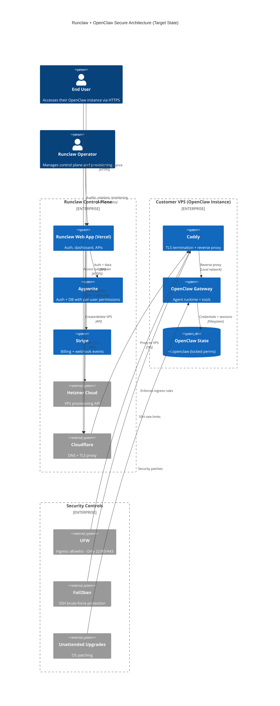

# Security Visual (C4 Diagram)

This diagram shows the **secure target state** after applying the deployment playbook and hardening checklist. It emphasizes private-by-default access, authenticated control paths, and least-privilege boundaries.

## Key Security Properties Shown

- Gateway is **behind** a reverse proxy and **not directly exposed**
- Control plane and billing are **authenticated** and **separated**
- Instance callbacks and provisioning are **secret-bound**
- Data at rest is protected by **strict filesystem permissions**
- VPS ingress is **restricted** and **rate-limited**
